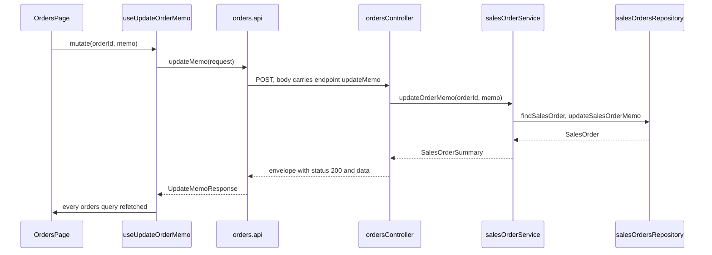

# A Restlet controller, end to end

One controller, `orders`: a page shows a customer's sales orders and lets someone change an order's memo in place.
The controller is one Restlet with two endpoints, `byCustomer` and `updateMemo`. The service decides what a caller
sees, the controller is the only code that knows the wire, `npm run generate` writes the client the browser calls,
and a query hook and a mutation hook sit between that client and the page.{{#if netsuiteRepository}} It reads and writes through the
repository functions of [repositories/model-and-repository.md](../repositories/model-and-repository.md).{{/if}}
{{#unless netsuiteRepository}}
The `salesOrdersRepository` it reads and writes through is not part of this project: its functions, and the
`SalesOrder` type the service imports from `../types/models.gen`, are the developer's to write.
{{/unless}}

## Steps

1. **The service**, `api/src/services/<domain>Service.ts`{{#if bothNetsuitePackages}} (the `nspService` snippet, every kind of service function,
   to delete down to what the controller calls){{/if}}: plain arguments in, a type the service declares out. What it
   exports starts with `get`, `create`, `update` or `remove` (`is` or `has` for a yes-or-no check), and it imports
   each repository as a namespace.
2. **The controller**, `api/src/controllers/<name>Controller.ts` (`nspControllerRestlet` or `nspControllerSuitelet`:
   every kind of endpoint, a guard and `authorize`, to delete down to what this controller serves).
3. **The SDF object**, `netsuite/Objects/customscript_{{prefix}}_<snake_name>.xml` (`nspObjectRestlet`).
4. **`npm run generate`**: writes the client module `client/src/api/<name>.gen.ts` from the controller.
5. **The hooks**, `client/src/hooks/use<What>.ts` (`nspHookQuery`, without its argument for an endpoint without a
   request; `nspHookMutation` for a write).
6. **The page and its route** (`nspPage`, `nspRoute`).
7. **The tests** (`nspTestController`, {{#if bothNetsuitePackages}}`nspTestService`, {{/if}}`nspTestHook`), each against a fake of the layer below.

`npm run lint` names any piece that is missing or disagrees with the others; `npm run generate` names a controller it
cannot turn into a client; `npm run typecheck` catches a client call that names an endpoint the controller lacks.

## The code

Everything a developer writes is below, in the order a request passes through it. Two things are not in the block
because they are not TypeScript:

- **`netsuite/Objects/customscript_{{prefix}}_orders.xml`**: the script record and its deployment (the
  `nspObjectRestlet` snippet writes it from the file name). Its `<restlet scriptid>` and `<scriptdeployment
  scriptid>` are the ids the controller declares, its `<scriptfile>` is
  `[/SuiteScripts/{{appName}}/api/controllers/ordersController.js]`, and its `<audslctrole>` says which roles may
  call it. `npm run lint` checks it against the controller.
- **The rest of `client/src/api/`**: `index.gen.ts` re-exports the new module as `orders`. Nobody edits it.

```typescript
// ─────────────────────────────────────────────────────────────────────────────────────────────────
// api/src/services/salesOrderService.ts                    the decisions: plain arguments in, a type of
//                                                          the service's own out
// ─────────────────────────────────────────────────────────────────────────────────────────────────

import type { SalesOrder } from '../types/models.gen';
import * as salesOrdersRepository from '../repositories/salesOrdersRepository';

/**
 * Decisions about sales orders. The service takes plain arguments and returns types it declares itself: it knows
 * nothing about the wire, so any controller, or a job, can call it and shape its own reply.
 */

/** A sales order as the service hands it up: what a caller may see of it, and how many lines are still open. */
export interface SalesOrderSummary extends Pick<SalesOrder, 'id' | 'tranId' | 'tranDate' | 'salesRepId' | 'statusText' | 'memo'> {
    openLineCount: number;
}

function buildSalesOrderSummary(salesOrder: SalesOrder): SalesOrderSummary {
    return {
        id: salesOrder.id,
        tranId: salesOrder.tranId,
        tranDate: salesOrder.tranDate,
        salesRepId: salesOrder.salesRepId,
        statusText: salesOrder.statusText,
        memo: salesOrder.memo,
        openLineCount: salesOrder.lines.filter((line) => !line.isClosed).length,
    };
}

/** Every sales order of the customer, newest first. */
export function getOrdersByCustomer(customerId: number): SalesOrderSummary[] {
    return salesOrdersRepository.listSalesOrdersByCustomer(customerId).map(buildSalesOrderSummary);
}

/** Replaces an order's memo; a memo of nothing but spaces clears it. Answers null when there is no such order. */
export function updateOrderMemo(orderId: number, memo: string): SalesOrderSummary | null {
    if (salesOrdersRepository.findSalesOrder(orderId) === null) return null;
    const trimmed = memo.trim();
    return buildSalesOrderSummary(salesOrdersRepository.updateSalesOrderMemo(orderId, trimmed === '' ? null : trimmed));
}

// ─────────────────────────────────────────────────────────────────────────────────────────────────
// api/src/controllers/ordersController.ts                  the whole controller: the wire, the endpoints,
//                                                          and the script that serves them
// ─────────────────────────────────────────────────────────────────────────────────────────────────

/**
 * @NApiVersion 2.1
 * @NScriptType Restlet
 * @NModuleScope SameAccount
 */

import { ApiError, defineEndpoints, defineRestlet } from '@amerilux/netsuite-api/server';
import { getOrdersByCustomer, updateOrderMemo, type SalesOrderSummary } from '../services/salesOrderService';

// The shapes are the wire: one request and one response per endpoint, named without the controller's name,
// because the generated module is scoped by controller already. Every one is exported: `npm run generate`
// copies them, with the service type they name, into client/src/api/orders.gen.ts.

export interface ByCustomerRequest {
    customerId: number;
}

export interface ByCustomerResponse {
    customerId: number;
    orders: SalesOrderSummary[];
}

export interface UpdateMemoRequest {
    orderId: number;
    memo: string;
}

export interface UpdateMemoResponse {
    order: SalesOrderSummary;
}

/** The wire promises a number; a caller that sends anything else gets a 400, not a query for NaN. */
function parseId(requested: number | string | undefined, field: string): number {
    const parsed = typeof requested === 'string' ? Number.parseInt(requested, 10) : requested;
    if (parsed === undefined || Number.isNaN(parsed) || parsed <= 0) {
        throw ApiError.badRequest(`${field} must be a positive whole number.`, { [field]: requested });
    }
    return parsed;
}

export const ordersEndpoints = defineEndpoints({
    /** Every sales order of the customer, newest first; 400 for a bad id. */
    byCustomer: (request: ByCustomerRequest): ByCustomerResponse => {
        const customerId = parseId(request.customerId, 'customerId');
        return { customerId, orders: getOrdersByCustomer(customerId) };
    },

    /** Replaces an order's memo and answers the order as it now stands; 404 when there is no such order. */
    updateMemo: (request: UpdateMemoRequest): UpdateMemoResponse => {
        const orderId = parseId(request.orderId, 'orderId');
        if (typeof request.memo !== 'string') throw ApiError.badRequest('memo must be text.', { memo: request.memo });
        // "No such order" is the service's answer; which HTTP status that is belongs to the wire, so here.
        const order = updateOrderMemo(orderId, request.memo);
        if (order === null) throw ApiError.notFound('No sales order has that id.', { orderId });
        return { order };
    },
});

/** The endpoint signatures as a type, for server code that calls this controller through a Suitelet client. */
export type OrdersEndpoints = typeof ordersEndpoints;

// The only transport-specific lines, with the header. The declaration creates nothing: it names the script this
// controller is deployed as, and the ids can be changed to whatever the record is called in NetSuite.
export const post = defineRestlet({
    name: 'orders',
    scriptId: 'customscript_{{prefix}}_orders',
    deployId: 'customdeploy_{{prefix}}_orders',
}, ordersEndpoints);

// ─────────────────────────────────────────────────────────────────────────────────────────────────
// client/src/api/orders.gen.ts                             what `npm run generate` writes from the
//                                                          controller (an excerpt); never edited
// ─────────────────────────────────────────────────────────────────────────────────────────────────

// A Date travels as an ISO string, so the copied entity type says string where the model says Date.
export interface SalesOrder {
    id: number;
    tranId: string;
    tranDate: string;
    customerId: number;
    salesRepId: number | null;
    memo: string | null;
    statusText: string;
    lastModified: string;
    lines: SalesOrderLine[];
}

// The client: the script the controller declares, and one function per endpoint that posts to it through the
// package's callEndpoint. A hook calls `orders.api.byCustomer(request, options)`.
const ordersScriptRef: ScriptRef = { kind: 'restlet', scriptId: 'customscript_{{prefix}}_orders', deployId: 'customdeploy_{{prefix}}_orders' };

export const api = {
    byCustomer: (request: ByCustomerRequest, options?: ApiCallOptions): Promise<ByCustomerResponse> => callEndpoint<ByCustomerResponse>(ordersScriptRef, 'byCustomer', request, options),
    updateMemo: (request: UpdateMemoRequest, options?: ApiCallOptions): Promise<UpdateMemoResponse> => callEndpoint<UpdateMemoResponse>(ordersScriptRef, 'updateMemo', request, options),
};

// ─────────────────────────────────────────────────────────────────────────────────────────────────
// client/src/hooks/useOrdersByCustomer.ts                  a query hook: the only code that calls the
//                                                          generated client for a read
// ─────────────────────────────────────────────────────────────────────────────────────────────────

import { queryOptions, useQuery } from '@tanstack/react-query';
import { orders } from '@/api/index.gen';

// Every key of this controller starts with its name, so a write can refetch all of them at once.
export const ordersByCustomerQueryKey = (customerId: number) => ['orders', 'byCustomer', customerId] as const;

export function ordersByCustomerQueryOptions(customerId: number) {
    return queryOptions({
        queryKey: ordersByCustomerQueryKey(customerId),
        queryFn: ({ signal }) => orders.api.byCustomer({ customerId }, { signal }),
    });
}

/** Every sales order of the customer, newest first. */
export function useOrdersByCustomer(customerId: number) {
    return useQuery(ordersByCustomerQueryOptions(customerId));
}

// ─────────────────────────────────────────────────────────────────────────────────────────────────
// client/src/hooks/useUpdateOrderMemo.ts                   a mutation hook: one write, then every query of
//                                                          the controller refetched
// ─────────────────────────────────────────────────────────────────────────────────────────────────

import { useMutation, useQueryClient } from '@tanstack/react-query';
import { orders } from '@/api/index.gen';

/** Replaces an order's memo. Every query of the orders controller is refetched afterwards. */
export function useUpdateOrderMemo() {
    const queryClient = useQueryClient();
    return useMutation({
        mutationFn: (request: orders.UpdateMemoRequest) => orders.api.updateMemo(request),
        onSuccess: () => queryClient.invalidateQueries({ queryKey: ['orders'] }),
    });
}

// ─────────────────────────────────────────────────────────────────────────────────────────────────
// client/src/pages/OrdersPage.tsx                          what is on screen: it calls hooks, never the
//                                                          client itself
// ─────────────────────────────────────────────────────────────────────────────────────────────────

import { useState } from 'react';
import type { orders } from '@/api/index.gen';
import { useOrdersByCustomer } from '@/hooks/useOrdersByCustomer';
import { useUpdateOrderMemo } from '@/hooks/useUpdateOrderMemo';

/**
 * A customer's sales orders, newest first, each memo editable in place. A failed call needs nothing here: it is
 * reported to the AppShell's banner before the query or the mutation sees it.
 */
export function OrdersPage({ customerId }: { customerId: number }) {
    const ordersByCustomer = useOrdersByCustomer(customerId);

    return (
        <section className="flex flex-col gap-4">
            <h2 className="text-lg font-semibold text-slate-900">Sales orders of customer {customerId}</h2>

            {ordersByCustomer.isPending && <p className="text-sm text-slate-500">Loading…</p>}

            {ordersByCustomer.isSuccess && (
                <table className="min-w-full text-left text-sm">
                    <thead className="bg-slate-50 text-xs uppercase tracking-wide text-slate-600">
                        <tr>
                            <th scope="col" className="px-3 py-2 font-medium">Order</th>
                            <th scope="col" className="px-3 py-2 font-medium">Date</th>
                            <th scope="col" className="px-3 py-2 font-medium">Status</th>
                            <th scope="col" className="px-3 py-2 font-medium">Open lines</th>
                            <th scope="col" className="px-3 py-2 font-medium">Memo</th>
                        </tr>
                    </thead>
                    <tbody className="divide-y divide-slate-200 bg-white">
                        {ordersByCustomer.data.orders.map((order) => (
                            <tr key={order.id}>
                                <td className="px-3 py-2 font-medium text-slate-900">{order.tranId}</td>
                                {/* An ISO string on the wire, so it is parsed to be shown. */}
                                <td className="px-3 py-2 text-slate-700">{new Date(order.tranDate).toLocaleDateString()}</td>
                                <td className="px-3 py-2 text-slate-700">{order.statusText}</td>
                                <td className="px-3 py-2 tabular-nums text-slate-700">{order.openLineCount}</td>
                                <td className="px-3 py-2"><MemoForm order={order} /></td>
                            </tr>
                        ))}
                    </tbody>
                </table>
            )}
        </section>
    );
}

/** One order's memo, saved on submit. The table refetches when the save succeeds. */
function MemoForm({ order }: { order: orders.SalesOrderSummary }) {
    const updateOrderMemo = useUpdateOrderMemo();
    const [memo, setMemo] = useState(order.memo ?? '');

    return (
        <form
            className="flex gap-2"
            onSubmit={(event) => {
                event.preventDefault();
                updateOrderMemo.mutate({ orderId: order.id, memo });
            }}
        >
            <input className="rounded border border-slate-300 px-2 py-1" value={memo} onChange={(event) => setMemo(event.target.value)} />
            <button type="submit" className="rounded bg-slate-900 px-3 py-1 text-white disabled:opacity-50" disabled={updateOrderMemo.isPending}>
                Save
            </button>
        </form>
    );
}

// ─────────────────────────────────────────────────────────────────────────────────────────────────
// client/src/routes/orders.$customerId.tsx                 the URL: #/orders/7 shows customer 7's orders
// ─────────────────────────────────────────────────────────────────────────────────────────────────

import { createFileRoute } from '@tanstack/react-router';
import { OrdersPage } from '@/pages/OrdersPage';

// The route owns the URL and the page owns the screen: the parameter is read here and handed over as a number.
export const Route = createFileRoute('/orders/$customerId')({
    component: function OrdersRoute() {
        const { customerId } = Route.useParams();
        return <OrdersPage customerId={Number(customerId)} />;
    },
});

// ─────────────────────────────────────────────────────────────────────────────────────────────────
// api/__tests__/controllers/ordersController.test.ts       a controller is tested against a mocked service:
//                                                          what the endpoints do with the wire
// ─────────────────────────────────────────────────────────────────────────────────────────────────

import { beforeEach, describe, expect, it, vi } from 'vitest';
import type { SalesOrderSummary } from '../../src/services/salesOrderService';

const { getOrdersByCustomer, updateOrderMemo } = vi.hoisted(() => ({
    getOrdersByCustomer: vi.fn<(customerId: number) => SalesOrderSummary[]>(),
    updateOrderMemo: vi.fn<(orderId: number, memo: string) => SalesOrderSummary | null>(),
}));
vi.mock('../../src/services/salesOrderService', () => ({ getOrdersByCustomer, updateOrderMemo }));

import { ordersEndpoints } from '../../src/controllers/ordersController';

const order: SalesOrderSummary = {
    id: 12,
    tranId: 'SO12',
    tranDate: new Date('2026-09-01T00:00:00Z'),
    salesRepId: 5,
    statusText: 'Pending Fulfillment',
    memo: 'Reviewed',
    openLineCount: 2,
};

beforeEach(() => {
    getOrdersByCustomer.mockReset();
    updateOrderMemo.mockReset();
});

describe('orders.byCustomer', () => {
    it('unpacks the id, calls the service with it and shapes the reply', () => {
        getOrdersByCustomer.mockReturnValue([order]);

        expect(ordersEndpoints.byCustomer({ customerId: 7 })).toEqual({ customerId: 7, orders: [order] });
        expect(getOrdersByCustomer).toHaveBeenCalledWith(7);
    });

    it('rejects an id that is not a positive whole number with a 400, before calling the service', () => {
        expect(() => ordersEndpoints.byCustomer({ customerId: 'abc' as unknown as number })).toThrow(expect.objectContaining({ status: 400 }));
        expect(getOrdersByCustomer).not.toHaveBeenCalled();
    });
});

describe('orders.updateMemo', () => {
    it('answers the order the service changed', () => {
        updateOrderMemo.mockReturnValue(order);

        expect(ordersEndpoints.updateMemo({ orderId: 12, memo: 'Reviewed' })).toEqual({ order });
    });

    it('answers 404 when the service finds no such order', () => {
        updateOrderMemo.mockReturnValue(null);

        expect(() => ordersEndpoints.updateMemo({ orderId: 99, memo: 'Reviewed' })).toThrow(expect.objectContaining({ status: 404 }));
    });
});
```

## What happens at run time



1. The page calls `updateOrderMemo.mutate(...)`. The hook calls `orders.api.updateMemo(request)`, the generated
   function, which hands the orders script, the endpoint's name and the request to the package's `callEndpoint`.
   That POSTs the request to the Restlet with an `endpoint` property naming `updateMemo`. Every call is a POST: the
   operation is the endpoint's name, so there is no HTTP method to choose.
2. `defineRestlet` reads the body, finds the endpoint, runs `authorize` when the controller has one, and calls the
   handler with the request.
3. The handler checks what came off the wire, calls the service with plain arguments, and shapes the response. The
   service reads and writes through the repository.
4. `defineRestlet` wraps what the handler answers in the envelope (`status`, `error`, `data`) and logs the call
   under a constant title (`endpoint completed`, `endpoint rejected`, `endpoint failed`). An `ApiError` becomes its
   status and message; anything else thrown is a 500.
5. `callEndpoint` unwraps the envelope. A failure is reported to the error banner (`reportApiError`, wired in
   `main.tsx`) and then thrown as an `ApiClientError`, so the page shows nothing of its own. On success the
   mutation refetches every query whose key starts with `orders`, and the table redraws.

## What `npm run generate` needs from the file

`npm run generate` reads the controller as source, without running it, so these are rules, each an error with a
message when broken:

- Every handler is written inline in `defineEndpoints({...})`, with its request and response types annotated. A
  handler with no parameter takes no request.
- Every type in the file is exported.
- A type is imported only from {{#if netsuiteRepository}}`../types/models.gen`, from {{/if}}a service under `../services/` (copied into the generated
  module{{#if netsuiteRepository}} with the entity types it is built on{{/if}}), or from another controller.
- The declaration is an object literal with literal ids, and its `name` is the file name without `Controller`.
  Script ids are unique across controllers.
- No shape is named `ApiCallOptions` or `ScriptRef`: the generated module imports those names for its client.
- A request shape carries no `Date`. A response may: it reaches the browser as an ISO string, and the generated
  module types it as `string`.

## The variations

- **A Suitelet instead of a Restlet** changes three things and no endpoint: the header says `@NScriptType Suitelet`,
  the last statement is `export const onRequest = defineSuitelet({ ... }, ordersEndpoints)`, and the SDF object is a
  `<suitelet>` (`nspObjectSuitelet`). [suitelet-controller.md](suitelet-controller.md) is the rest of what a Suitelet
  can do. Under `npm run dev` only Restlets are reachable: the local proxy signs with an OAuth 2.0 token, which
  NetSuite accepts for Restlets and not for Suitelets.
- **Only some callers may use an endpoint**: `authorize: ({ endpoint, request }) => void` after the endpoints runs
  before every handler; throw `ApiError.forbidden()` to refuse (the controller snippets write one). It reads the
  session through a service, because an endpoint never imports a repository.
- **A page that shows a failure in place** reads the query's `isError` and `error` (an `ApiClientError` carrying the
  status, the message and the `details` the handler gave its `ApiError`), and its hook passes
  `{ handleError: false }` as the call's second argument, so the banner stays out of it.
- **An endpoint without a request** takes no parameter (`roles: (): RolesResponse => ...`{{#if userRolesExample}} in the shipped
  `userController.ts`{{/if}}). Its generated function takes the call options alone, so its hook calls it as
  `user.api.roles({ signal })` (the `nspHookQuery` snippet without its argument).
