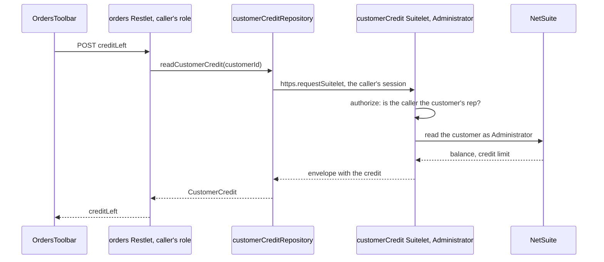

# A Suitelet controller, end to end

Two things only a Suitelet can do, on the orders page of [restlet-controller.md](restlet-controller.md):

- **Run as another role.** A sales rep should see how much credit a customer has left, but the role a sales rep
  logs in with usually cannot read a customer's balance. A Restlet always runs as the caller's role; a Suitelet's
  deployment can run as another one. So the `customerCredit` Suitelet runs as Administrator and answers the credit,
  the `orders` Restlet asks it from a repository, and the Suitelet's `authorize` decides for itself who may ask,
  because its role no longer says anything about the caller.
- **Answer with a document.** The `orderExports` Suitelet answers a customer's orders as a CSV file the browser
  downloads. A Restlet can only answer JSON.

{{#if netsuiteRepository}}It reads through the repository functions of [repositories/model-and-repository.md](../repositories/model-and-repository.md)
and adds{{/if}}{{#unless netsuiteRepository}}It adds{{/unless}} an endpoint to the orders controller of [restlet-controller.md](restlet-controller.md). A customer's credit
is the Customer record's, so its decisions go in a `customerService`, not in the sales order's: the orders controller
calls it as it would any service.
{{#unless netsuiteRepository}}
The `customersRepository.findCustomer` the service calls, and the `activeUserRepository.readActiveUser` that says who
is calling, are not part of this project: they are the developer's to write.
{{/unless}}

## Steps

The steps are a controller's ([restlet-controller.md](restlet-controller.md)), with three differences:

1. **The controller** starts from `nspControllerSuitelet`: the header says `@NScriptType Suitelet` and the entry point
   is `export const onRequest = defineSuitelet(...)`. A Suitelet only server code calls says `browser: false`, and
   `npm run generate` then writes its types and no client.
2. **The SDF object** starts from `nspObjectSuitelet`, whose deployment runs as Administrator (`<runasrole>`); delete
   that line for a Suitelet that should run as the caller.
3. **A server-side caller** reaches it through a repository (`nspRepositorySuitelet`, tested with
   `nspTestRepositorySuitelet`), never from a service or a controller.

## The code

Everything a developer writes is below, in the order a request passes through it. Two things are not in the block
because they are not TypeScript:

- **`netsuite/Objects/customscript_{{prefix}}_customer_credit.xml`** and
  **`netsuite/Objects/customscript_{{prefix}}_order_exports.xml`**: the two script records (the `nspObjectSuitelet`
  snippet). The first deployment carries `<runasrole>ADMINISTRATOR</runasrole>`, which is what lets the script read
  the balance; the second has no `<runasrole>` and runs as whoever calls it. `npm run lint` checks both against
  their controllers.
- **`client/src/api/customerCredit.gen.ts`** and **`client/src/api/orderExports.gen.ts`**, written by
  `npm run generate`. The first holds types only (`browser: false`); the second's client resolves `csvByCustomer`
  to a `Blob`, because its handler answers `RawResponse`.

```typescript
{{#if netsuiteRepository}}
// ─────────────────────────────────────────────────────────────────────────────────────────────────
// api/src/models/Customer.ts                               the record the Suitelet reads as Administrator
// ─────────────────────────────────────────────────────────────────────────────────────────────────

import { Field, NetsuiteRecordType, ReadOnly, RecordType } from '@amerilux/netsuite-repository';

/**
 * A customer: who looks after it, and where it stands on credit.
 * Run `npm run generate` after editing: it refreshes api/src/repositories/generated/ and api/src/types/models.gen.ts.
 */
@RecordType(NetsuiteRecordType.CUSTOMER)
export class Customer {
    id!: number;

    @Field('companyname')
    companyName!: string;

    @Field('salesrep', { type: 'select' })
    salesRepId!: number | null;

    /** Queried as `balancesearch`, written (never, here) as `balance`: NetSuite names it differently on each side. */
    @Field('balance', { queryFieldId: 'balancesearch' })
    @ReadOnly()
    balance!: number | null;

    @Field('creditlimit')
    creditLimit!: number | null;
}

// ─────────────────────────────────────────────────────────────────────────────────────────────────
// api/src/repositories/customersRepository.ts              reads a customer; whoever runs it needs a role
//                                                          that may
// ─────────────────────────────────────────────────────────────────────────────────────────────────

import type { Customer } from '../types/models.gen';
import { dbContext } from './generated/context.gen';

/** One customer, or null when no customer has the id. */
export function findCustomer(customerId: number): Customer | null {
    return dbContext.customers.find(customerId);
}

{{/if}}
// ─────────────────────────────────────────────────────────────────────────────────────────────────
// api/src/services/customerService.ts                      the Customer's domain: where it stands on credit,
//                                                          and who may see it
// ─────────────────────────────────────────────────────────────────────────────────────────────────

import * as activeUserRepository from '../repositories/activeUserRepository';
import * as customersRepository from '../repositories/customersRepository';

/**
 * Decisions about customers. Which role a function needs is its script's concern, not the service's: the functions
 * here read the customer directly, so they work in the customerCredit Suitelet, which runs as Administrator;
 * `getCreditLeft`, added below, reads through that Suitelet, so it works in any script.
 */

/** Where a customer stands on credit. */
export interface CustomerCredit {
    customerId: number;
    balance: number;
    creditLimit: number | null;
    /** What the customer may still order on credit; null when no limit is set. */
    creditLeft: number | null;
}

/** Where the customer stands on credit, or null when there is no such customer. */
export function getCustomerCredit(customerId: number): CustomerCredit | null {
    const customer = customersRepository.findCustomer(customerId);
    if (customer === null) return null;
    const balance = customer.balance ?? 0;
    const creditLeft = customer.creditLimit === null ? null : customer.creditLimit - balance;
    return { customerId, balance, creditLimit: customer.creditLimit, creditLeft };
}

/**
 * True when the caller is the customer's sales rep. Running as another role changes the role a script runs with,
 * not the user: the session still says who is calling.
 */
export function isSalesRepOfCustomer(customerId: number): boolean {
    const customer = customersRepository.findCustomer(customerId);
    return customer !== null && customer.salesRepId === activeUserRepository.readActiveUser().id;
}

// ─────────────────────────────────────────────────────────────────────────────────────────────────
// api/src/controllers/customerCreditController.ts          a Suitelet only server code calls, running as
//                                                          Administrator
// ─────────────────────────────────────────────────────────────────────────────────────────────────

/**
 * @NApiVersion 2.1
 * @NScriptType Suitelet
 * @NModuleScope SameAccount
 */

import { ApiError, defineEndpoints, defineSuitelet } from '@amerilux/netsuite-api/server';
import { getCustomerCredit, isSalesRepOfCustomer, type CustomerCredit } from '../services/customerService';

export interface ByCustomerRequest {
    customerId: number;
}

export interface ByCustomerResponse {
    credit: CustomerCredit;
}

/** The wire promises a number; a caller that sends anything else gets a 400. */
function parseCustomerId(requested: unknown): number {
    const parsed = typeof requested === 'string' ? Number.parseInt(requested, 10) : requested;
    if (typeof parsed !== 'number' || !Number.isInteger(parsed) || parsed <= 0) {
        throw ApiError.badRequest('customerId must be a positive whole number.', { customerId: requested });
    }
    return parsed;
}

export const customerCreditEndpoints = defineEndpoints({
    /** Where the customer stands on credit; 404 for a customer that does not exist. */
    byCustomer: (request: ByCustomerRequest): ByCustomerResponse => {
        const customerId = parseCustomerId(request.customerId);
        const credit = getCustomerCredit(customerId);
        if (credit === null) throw ApiError.notFound('No customer has that id.', { customerId });
        return { credit };
    },
});

/** The endpoint signatures as a type: what the orders Restlet's repository builds its client from. */
export type CustomerCreditEndpoints = typeof customerCreditEndpoints;

// `browser: false`: the browser never calls this script, so `npm run generate` writes its types and no client.
export const onRequest = defineSuitelet({
    name: 'customerCredit',
    scriptId: 'customscript_{{prefix}}_customer_credit',
    deployId: 'customdeploy_{{prefix}}_customer_credit',
    browser: false,
}, customerCreditEndpoints, {
    // The script runs as Administrator and answers for any customer id, so it decides who may ask: authorize runs
    // before every handler, sees the request as it came off the wire, and refuses by throwing.
    authorize: ({ request }) => {
        if (!isSalesRepOfCustomer(parseCustomerId(request.customerId))) {
            throw ApiError.forbidden("Only the customer's sales rep may read its credit.");
        }
    },
});

// ─────────────────────────────────────────────────────────────────────────────────────────────────
// api/src/repositories/customerCreditRepository.ts         the orders Restlet's way in: another script of
//                                                          this application is a data source like any other
// ─────────────────────────────────────────────────────────────────────────────────────────────────

import { createSuiteletClient } from '@amerilux/netsuite-api/server';
import type { ByCustomerResponse, CustomerCreditEndpoints } from '../controllers/customerCreditController';
import { scripts } from '../scripts.gen';

/**
 * A customer's credit, read through the customerCredit Suitelet, which runs as Administrator. What comes back is
 * that script's wire shape, so the type is taken from its controller, as a type only. The service that calls this
 * does not know the answer came from another script.
 */
const customerCreditApi = createSuiteletClient<CustomerCreditEndpoints>(scripts.customerCredit);

/** Where the customer stands on credit. A refusal or a failure there arrives here as the same ApiError. */
export function readCustomerCredit(customerId: number): ByCustomerResponse['credit'] {
    return customerCreditApi.byCustomer({ customerId }).credit;
}

// ─────────────────────────────────────────────────────────────────────────────────────────────────
// api/src/services/customerService.ts                      adds what the orders Restlet asks: the credit left,
//                                                          read through the Suitelet
// ─────────────────────────────────────────────────────────────────────────────────────────────────

import * as customerCreditRepository from '../repositories/customerCreditRepository';

/** What the customer may still order on credit; null when no limit is set. Any script may call it. */
export function getCreditLeft(customerId: number): number | null {
    return customerCreditRepository.readCustomerCredit(customerId).creditLeft;
}

// ─────────────────────────────────────────────────────────────────────────────────────────────────
// api/src/controllers/ordersController.ts                  adds one endpoint to the controller of
//                                                          restlet-controller.md
// ─────────────────────────────────────────────────────────────────────────────────────────────────

import { getCreditLeft } from '../services/customerService';

export interface CreditLeftRequest {
    customerId: number;
}

export interface CreditLeftResponse {
    customerId: number;
    creditLeft: number | null;
}

export const ordersEndpoints = defineEndpoints({
    /** What the customer may still order on credit; 403 unless the caller is the customer's sales rep. */
    creditLeft: (request: CreditLeftRequest): CreditLeftResponse => {
        const customerId = parseId(request.customerId, 'customerId');
        return { customerId, creditLeft: getCreditLeft(customerId) };
    },
});

// ─────────────────────────────────────────────────────────────────────────────────────────────────
// api/src/controllers/orderExportsController.ts            a Suitelet the browser calls, answering a file
// ─────────────────────────────────────────────────────────────────────────────────────────────────

/**
 * @NApiVersion 2.1
 * @NScriptType Suitelet
 * @NModuleScope SameAccount
 */

import { ApiError, defineEndpoints, defineSuitelet, rawResponse, type RawResponse } from '@amerilux/netsuite-api/server';
import { getOrdersByCustomer } from '../services/salesOrderService';

export interface CsvByCustomerRequest {
    customerId: number;
}

/** The wire promises a number; a caller that sends anything else gets a 400. */
function parseCustomerId(requested: unknown): number {
    const parsed = typeof requested === 'string' ? Number.parseInt(requested, 10) : requested;
    if (typeof parsed !== 'number' || !Number.isInteger(parsed) || parsed <= 0) {
        throw ApiError.badRequest('customerId must be a positive whole number.', { customerId: requested });
    }
    return parsed;
}

/** One CSV cell, quoted when it holds a comma, a quote or a line break. */
function buildCsvCell(value: string | number | null): string {
    const text = value === null ? '' : String(value);
    return /[",\r\n]/.test(text) ? `"${text.replace(/"/g, '""')}"` : text;
}

export const orderExportsEndpoints = defineEndpoints({
    /** The customer's sales orders as a CSV file. The return type is written exactly `RawResponse`: the generator reads it. */
    csvByCustomer: (request: CsvByCustomerRequest): RawResponse => {
        const customerId = parseCustomerId(request.customerId);
        const rows = getOrdersByCustomer(customerId).map((order) =>
            [order.tranId, order.tranDate.toISOString().slice(0, 10), order.statusText, order.openLineCount, order.memo].map(buildCsvCell).join(','));
        return rawResponse({ contentType: 'text/csv', body: ['Order,Date,Status,Open lines,Memo', ...rows].join('\r\n'), fileName: `orders-${customerId}.csv` });
    },
});

export type OrderExportsEndpoints = typeof orderExportsEndpoints;

export const onRequest = defineSuitelet({
    name: 'orderExports',
    scriptId: 'customscript_{{prefix}}_order_exports',
    deployId: 'customdeploy_{{prefix}}_order_exports',
}, orderExportsEndpoints);

// ─────────────────────────────────────────────────────────────────────────────────────────────────
// client/src/hooks/orders/useCreditLeft.ts                 a query hook, as for any endpoint
// ─────────────────────────────────────────────────────────────────────────────────────────────────

import { queryOptions, useQuery } from '@tanstack/react-query';
import { orders } from '@/api/index.gen';

export const creditLeftQueryKey = (customerId: number) => ['orders', 'creditLeft', customerId] as const;

export function creditLeftQueryOptions(customerId: number) {
    return queryOptions({
        queryKey: creditLeftQueryKey(customerId),
        // A 403 is an answer here, not a fault: the caller is simply not this customer's rep, so the banner stays out.
        queryFn: ({ signal }) => orders.api.creditLeft({ customerId }, { signal, handleError: false }),
    });
}

/** What the customer may still order on credit. */
export function useCreditLeft(customerId: number) {
    return useQuery(creditLeftQueryOptions(customerId));
}

// ─────────────────────────────────────────────────────────────────────────────────────────────────
// client/src/hooks/orderExports/useDownloadOrdersCsv.ts    a mutation: a download is something someone does,
//                                                          not data a page shows
// ─────────────────────────────────────────────────────────────────────────────────────────────────

import { useMutation } from '@tanstack/react-query';
import { orderExports } from '@/api/index.gen';

export function downloadOrdersCsvMutationOptions() {
    return {
        mutationFn: async (customerId: number) => {
            // The client resolves a raw endpoint to a Blob. The Blob carries the body, not the file name, so the name
            // is given again here.
            const file = await orderExports.api.csvByCustomer({ customerId });
            const link = document.createElement('a');
            link.href = URL.createObjectURL(file);
            link.download = `orders-${customerId}.csv`;
            link.click();
            URL.revokeObjectURL(link.href);
        },
    };
}

/** Downloads the customer's sales orders as a CSV file. */
export function useDownloadOrdersCsv() {
    return useMutation(downloadOrdersCsvMutationOptions());
}

// ─────────────────────────────────────────────────────────────────────────────────────────────────
// client/src/components/OrdersToolbar.tsx                  what the orders page shows above its table:
//                                                          <OrdersToolbar customerId={customerId} />
// ─────────────────────────────────────────────────────────────────────────────────────────────────

import { useCreditLeft } from '@/hooks/orders/useCreditLeft';
import { useDownloadOrdersCsv } from '@/hooks/orderExports/useDownloadOrdersCsv';

/** The customer's credit left, when the caller may see it, and the CSV download. */
export function OrdersToolbar({ customerId }: { customerId: number }) {
    const creditLeft = useCreditLeft(customerId);
    const downloadOrdersCsv = useDownloadOrdersCsv();

    return (
        <div className="flex items-center gap-4 text-sm text-slate-700">
            {creditLeft.isSuccess && (
                <span>Credit left: {creditLeft.data.creditLeft === null ? 'no limit' : creditLeft.data.creditLeft.toFixed(2)}</span>
            )}
            {creditLeft.isError && <span className="text-slate-500">Credit is visible to the customer's sales rep only.</span>}
            <button
                type="button"
                className="rounded border border-slate-300 px-3 py-1 disabled:opacity-50"
                disabled={downloadOrdersCsv.isPending}
                onClick={() => downloadOrdersCsv.mutate(customerId)}
            >
                Download CSV
            </button>
        </div>
    );
}

// ─────────────────────────────────────────────────────────────────────────────────────────────────
// api/__tests__/repositories/customerCreditRepository.test.ts
//                                                          a Suitelet client is tested against a fake: what
//                                                          it asks the other script for
// ─────────────────────────────────────────────────────────────────────────────────────────────────

import { beforeEach, describe, expect, it, vi } from 'vitest';
import { scripts } from '../../src/scripts.gen';

const { byCustomer, createSuiteletClient } = vi.hoisted(() => {
    const byCustomer = vi.fn();
    return { byCustomer, createSuiteletClient: vi.fn(() => ({ byCustomer })) };
});
vi.mock('@amerilux/netsuite-api/server', () => ({ createSuiteletClient }));

import { readCustomerCredit } from '../../src/repositories/customerCreditRepository';

// The client is built when the module loads, before any test runs, and mock state is cleared per test: keep the call.
const clientConstructionArguments = createSuiteletClient.mock.calls[0] as unknown[] | undefined;

beforeEach(() => {
    byCustomer.mockReset();
});

describe('readCustomerCredit', () => {
    it('builds the client for the customerCredit script', () => {
        expect(clientConstructionArguments).toEqual([scripts.customerCredit]);
    });

    it('asks the Suitelet for the customer and answers its credit', () => {
        const credit = { customerId: 7, balance: 250, creditLimit: 1000, creditLeft: 750 };
        byCustomer.mockReturnValue({ credit });

        expect(readCustomerCredit(7)).toBe(credit);
        expect(byCustomer).toHaveBeenCalledWith({ customerId: 7 });
    });
});
```

## What happens at run time



1. **The credit.** The page asks the `orders` Restlet, which runs as the caller's role. It calls
   `customerService.getCreditLeft`, which asks `readCustomerCredit`, and the repository's Suitelet client POSTs to the `customerCredit` Suitelet through
   `https.requestSuitelet`, on the caller's session. NetSuite runs the Suitelet as Administrator, as its deployment
   says. `defineSuitelet` finds the endpoint and runs `authorize` first: the session still says who the caller is,
   so the check is on the user, not the role. The handler reads the customer with the Administrator's rights and
   answers the envelope. The Suitelet client unwraps it; an error envelope becomes an `ApiError` with the status
   the Suitelet answered, so a 403 there is a 403 from the Restlet too.
2. **The download.** The page calls `orderExports.api.csvByCustomer(...)` straight from the browser. The handler
   answers `rawResponse(...)`, so `defineSuitelet` writes the CSV as the response, with its content type and a
   download file name, instead of the JSON envelope. The generated client, told by `npm run generate` that the
   endpoint answers `RawResponse`, resolves the call to a `Blob`. A failure still arrives as an envelope, and is
   reported and thrown like any other.

## The variations

- **A File Cabinet file or a rendered PDF** is answered with `rawResponse({ file, inline })`: `file` is an `N/file`
  object read in a repository, and `inline: true` shows it in the browser where it can instead of downloading it.
- **A Suitelet the browser calls** does not work under `npm run dev`: the local proxy signs requests with an
  OAuth 2.0 token, and NetSuite accepts one for Restlets, not for Suitelets. Try it in the account.
- **A Suitelet that runs as the caller** needs no `authorize` beyond what any controller needs: delete the
  `<runasrole>` line from its deployment, as `orderExports` does, and NetSuite's own permissions apply.
{{#if userRolesExample}}
- **The shipped reference** is the `userRoles` Suitelet (`browser: false`, running as Administrator) and the
  `userRolesRepository.ts` that the `user` Restlet reaches it through.
{{/if}}
