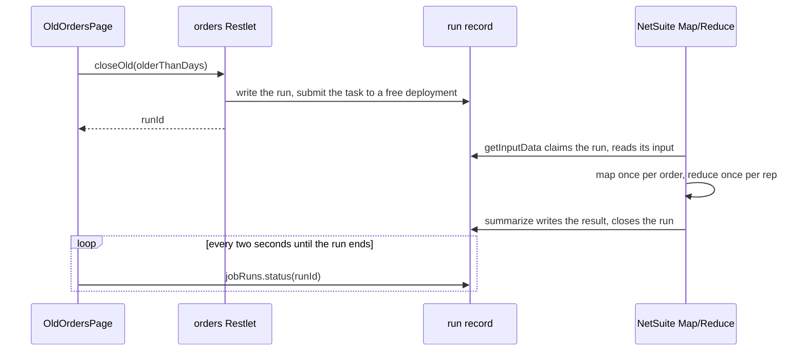

# A Map/Reduce job, end to end

One job, `closeOldOrders`: a page asks for every sales order older than N days to be closed, the work is split one
order per map stage, the outcomes are tallied per sales rep in a reduce stage, and the page follows the run until
it ends and reads the tally. {{#if netsuiteRepository}}It reads and writes through the repository functions of
[repositories/model-and-repository.md](../repositories/model-and-repository.md), and is started{{/if}}{{#unless netsuiteRepository}}It is started{{/unless}} from the controller
of [controllers/restlet-controller.md](../controllers/restlet-controller.md).
{{#unless netsuiteRepository}}
The `salesOrdersRepository` functions its service calls are not part of this project: they are the developer's to
write.
{{/unless}}

A job is background work: NetSuite runs it in stages, and it answers nothing to whoever started it. What stands in
for an answer is a **run**, a row in this application's own run record. Starting a job writes the run and hands back
its id; the stages read the run's input from it and write the result to it; a page follows the run by that id until
it ends.

## Steps

1. **`npm run add:jobs`**, once per project, before the first job. It adds the run record and its SDF object, the
   cleanup job that clears old runs daily, the repository and service that read a run, the `jobRuns` controller a
   page polls (its `status` and `mine` endpoints), the `useJobRun` hook, the `jobs` block in `netsuite.ts` and the
   `jobRuns` block in `netsuite-api.config.json`. It adds nothing that is already there, so running it again is safe.
2. **The job's ids in `netsuite.ts`**, under `jobs`, as in the code below; `parameters` for a script parameter of its
   own. They are written by hand, once, and the same ids go in the SDF object at step 7.
3. **`api/src/jobs/<name>/<name>.ts`**, the file NetSuite loads (`nspJob`): the header, and the stages it exports;
   the snippet exports all four, and a job without a reduce stage deletes that line.
4. **`api/src/jobs/<name>/contract.ts`** (`nspJobContract`): every shape the run carries, hop by hop, in one file.
   Every stage imports its types from here.
5. **A file per stage beside it** (`nspJobGetInputData`, `nspJobMap`, `nspJobReduce`, `nspJobSummarize`). Export
   `summarize` always: the run is closed there, and a job without it leaves every run looking unfinished.
6. **`api/src/jobs/<name>/start.ts`** (`nspJobStart`): how a run is started, for a controller to call.
7. **The SDF object**, `netsuite/Objects/customscript_{{prefix}}_<snake_name>_mr.xml` (`nspObjectMapReduce`).
8. **`npm run generate`**: writes `client/src/api/<name>Job.gen.ts`, the result's type, reached as
   `jobs.<name>.Result` from `@/api/index.gen`.
9. **An endpoint that starts it, a mutation hook that calls it, and a page that follows the run** with `useJobRun`.
10. **Tests**, one per stage, with the contexts `@amerilux/netsuite-api/testing` builds.

## The code

Everything a developer writes is below, in the order NetSuite runs it. Two things are not in the block because they
are not TypeScript:

- **`netsuite/Objects/customscript_{{prefix}}_close_old_orders_mr.xml`**: the script record (the `nspObjectMapReduce`
  snippet writes it). It declares `<scriptid>`, one `<scriptdeployment>` per deployment, a
  `<scriptcustomfield scriptid="custscript_{{prefix}}_close_old_orders_run">` for the run id, and
  `<scriptfile>[/SuiteScripts/{{appName}}/api/jobs/closeOldOrders/closeOldOrders.js]</scriptfile>`. `npm run lint`
  checks it against the ids in netsuite.ts.
- **`client/src/api/closeOldOrdersJob.gen.ts`**: written by `npm run generate`, holding `Result` and the shapes it
  names. Nobody edits it.

```typescript
// ─────────────────────────────────────────────────────────────────────────────────────────────────
// netsuite.ts                                              adds the job's ids to the `jobs` object that
//                                                          `npm run add:jobs` wrote, beside its cleanup job
// ─────────────────────────────────────────────────────────────────────────────────────────────────

export const jobs = {
    closeOldOrders: {
        name: 'closeOldOrders',
        scriptId: 'customscript_{{prefix}}_close_old_orders_mr',
        // NetSuite runs one instance of a deployment at a time, so this is how many runs can overlap.
        deployments: ['customdeploy_{{prefix}}_close_old_orders_mr', 'customdeploy_{{prefix}}_close_old_orders_mr_2'],
        runParameter: 'custscript_{{prefix}}_close_old_orders_run',
    },
} as const;

// ─────────────────────────────────────────────────────────────────────────────────────────────────
// api/src/repositories/jobRunRepository.ts                 written once by `npm run add:jobs` (an excerpt);
//                                                          no job touches it again
// ─────────────────────────────────────────────────────────────────────────────────────────────────

const jobRunStore = createJobRunStore(jobRuns);

/** What a stage is built with. */
export const { jobGetInputData, jobMap, jobReduce, jobSummarize } = createJobStages(jobRunStore);

/** Starts a job and answers the run id. Throws a 409 when every deployment is already running. */
export function startJobRun(job: JobRef, input: unknown): string {
    return jobRunStore.start(job, input);
}

// ─────────────────────────────────────────────────────────────────────────────────────────────────
// api/src/services/salesOrderService.ts                    adds the two decisions the job calls to the
//                                                          service of controllers/restlet-controller.md
// ─────────────────────────────────────────────────────────────────────────────────────────────────

import * as salesOrdersRepository from '../repositories/salesOrdersRepository';

const MILLISECONDS_PER_DAY = 24 * 60 * 60 * 1000;

/** The open orders nobody has changed for the given number of days. */
export function getOldOrders(olderThanDays: number): SalesOrderSummary[] {
    const cutoff = new Date(Date.now() - olderThanDays * MILLISECONDS_PER_DAY);
    return salesOrdersRepository.listSalesOrdersNotModifiedSince(cutoff).map(buildSalesOrderSummary);
}

/** What closing one order came to. */
export interface OrderClosing {
    closed: boolean;
    reason: string;
}

/** Closes every open line of the order, unless there is nothing left to close. */
export function updateOrderClosed(orderId: number): OrderClosing {
    const salesOrder = salesOrdersRepository.findSalesOrder(orderId);
    if (salesOrder === null) return { closed: false, reason: 'No such order' };
    const openLineIds = salesOrder.lines.filter((line) => !line.isClosed).map((line) => line.id);
    if (openLineIds.length === 0) return { closed: false, reason: 'Already closed' };
    salesOrdersRepository.updateSalesOrderLinesClosed(orderId, openLineIds);
    return { closed: true, reason: 'Closed' };
}

// ─────────────────────────────────────────────────────────────────────────────────────────────────
// api/src/jobs/closeOldOrders/closeOldOrders.ts            the file NetSuite loads: the header, and
//                                                          which stages there are. Nothing imports it.
// ─────────────────────────────────────────────────────────────────────────────────────────────────

/**
 * @NApiVersion 2.1
 * @NScriptType MapReduceScript
 * @NModuleScope SameAccount
 */

/** Closes the sales orders nobody has touched for long enough, and tallies them by sales rep. */
export { getInputData } from './getInputData';
export { map } from './map';
export { reduce } from './reduce';
export { summarize } from './summarize';

// ─────────────────────────────────────────────────────────────────────────────────────────────────
// api/src/jobs/closeOldOrders/contract.ts                  every shape the run carries, hop by hop;
//                                                          the stages import from here
// ─────────────────────────────────────────────────────────────────────────────────────────────────

/** What a run of this job is asked to do; whatever starts a run builds this. */
export interface CloseOldOrdersRequest {
    olderThanDays: number;
}

/** One piece of the work: what getInputData answers and the map stage is handed. */
export interface CloseOldOrdersItem {
    orderId: number;
    salesRepId: number | null;
}

/** What closing one order came to: what map writes, and what reduce gathers under one rep. */
export interface CloseOutcome {
    orderId: number;
    salesRepId: number | null;
    closed: boolean;
    reason: string;
}

/** One rep's share of the run, as reduce writes it; a null rep is the orders nobody is assigned to. */
export interface RepTally {
    salesRepId: number | null;
    closed: number;
    failed: number;
}

/** What a finished run leaves behind; the page reads it as `jobs.closeOldOrders.Result`. */
export interface CloseOldOrdersResult {
    closed: number;
    failed: number;
    byRep: RepTally[];
}

// ─────────────────────────────────────────────────────────────────────────────────────────────────
// api/src/jobs/closeOldOrders/getInputData.ts              1. what the work is
// ─────────────────────────────────────────────────────────────────────────────────────────────────

import { jobs } from '../../../../netsuite';
import { jobGetInputData } from '../../repositories/jobRunRepository';
import { getOldOrders } from '../../services/salesOrderService';
import type { CloseOldOrdersItem, CloseOldOrdersRequest } from './contract';

// The two types are the stage's claim: a run is started with a CloseOldOrdersRequest, and the work is a list of
// CloseOldOrdersItem. The builder opens the run first, so `input` is what it was started with, already parsed off
// the run record, not a script parameter to decode.
export const getInputData = jobGetInputData<CloseOldOrdersRequest, CloseOldOrdersItem>(jobs.closeOldOrders, (input) =>
    getOldOrders(input.olderThanDays).map((order) => ({ orderId: order.id, salesRepId: order.salesRepId })));

// ─────────────────────────────────────────────────────────────────────────────────────────────────
// api/src/jobs/closeOldOrders/map.ts                       2. one item of it, once per order
// ─────────────────────────────────────────────────────────────────────────────────────────────────

import { jobs } from '../../../../netsuite';
import { jobMap } from '../../repositories/jobRunRepository';
import { updateOrderClosed } from '../../services/salesOrderService';
import type { CloseOldOrdersItem, CloseOutcome } from './contract';

export const map = jobMap<CloseOldOrdersItem, CloseOutcome>(jobs.closeOldOrders, (item, job) => {
    // `item` arrives parsed, and what `job.write` is given travels on as JSON: neither is this stage's business.
    // The key is what groups the values for the reduce stage, here the rep, and it only groups: the rep id rides
    // in the value, so nothing has to parse it back out of the key.
    const closing = updateOrderClosed(item.orderId);
    job.write(String(item.salesRepId), { orderId: item.orderId, salesRepId: item.salesRepId, closed: closing.closed, reason: closing.reason });

    // A throw here fails this one order, not the run: NetSuite collects it, and it ends up on the run record with
    // its key. `job.runId` is here too, for a stage that stamps a record with its run.
});

// ─────────────────────────────────────────────────────────────────────────────────────────────────
// api/src/jobs/closeOldOrders/reduce.ts                    3. everything written under one key
// ─────────────────────────────────────────────────────────────────────────────────────────────────

import { jobs } from '../../../../netsuite';
import { jobReduce } from '../../repositories/jobRunRepository';
import type { CloseOutcome, RepTally } from './contract';

// Reads what map wrote (CloseOutcome), writes what summarize will read (RepTally). Both come from contract.ts, so
// map, reduce and summarize name the one declaration of each: nothing compares a claim in one stage file against a
// claim in another, and that is what keeps them together.
export const reduce = jobReduce<CloseOutcome, RepTally>(jobs.closeOldOrders, (key, outcomes, job) => {
    const closed = outcomes.filter((outcome) => outcome.closed).length;
    job.write(key, { salesRepId: outcomes[0]?.salesRepId ?? null, closed, failed: outcomes.length - closed });
});

// ─────────────────────────────────────────────────────────────────────────────────────────────────
// api/src/jobs/closeOldOrders/summarize.ts                 4. what the run came to
// ─────────────────────────────────────────────────────────────────────────────────────────────────

import { jobs } from '../../../../netsuite';
import { jobSummarize } from '../../repositories/jobRunRepository';
import type { CloseOldOrdersResult, RepTally } from './contract';

// What this answers is written onto the run as its result and closes the run, which is what a page polling the
// run is waiting for. `summary` also carries everything NetSuite collected: `errors` (every key that failed, and
// the input stage's own failure), `seconds`, `usage`, `yields`.
export const summarize = jobSummarize<RepTally, CloseOldOrdersResult>(jobs.closeOldOrders, (summary) => {
    const byRep = summary.output.map((entry) => entry.value);
    return {
        closed: byRep.reduce((total, rep) => total + rep.closed, 0),
        failed: byRep.reduce((total, rep) => total + rep.failed, 0),
        byRep,
    };
});

// ─────────────────────────────────────────────────────────────────────────────────────────────────
// api/src/jobs/closeOldOrders/start.ts                     how a run is started: the one file of the
//                                                          folder that is not a stage
// ─────────────────────────────────────────────────────────────────────────────────────────────────

import { jobs } from '../../../../netsuite';
import { startJobRun } from '../../repositories/jobRunRepository';
import type { CloseOldOrdersRequest } from './contract';

/**
 * Starts a run and answers its id; the page follows the run by that id. Throws a 409 when every deployment is
 * already running: nothing was started, so no run is left behind to poll.
 */
export function startClosingOldOrders(olderThanDays: number): string {
    return startJobRun(jobs.closeOldOrders, { olderThanDays } satisfies CloseOldOrdersRequest);
}

// ─────────────────────────────────────────────────────────────────────────────────────────────────
// api/src/controllers/ordersController.ts                  adds the endpoint that starts it to the
//                                                          controller of controllers/restlet-controller.md
// ─────────────────────────────────────────────────────────────────────────────────────────────────

import { defineEndpoints } from '@amerilux/netsuite-api/server';
import { startClosingOldOrders } from '../jobs/closeOldOrders/start';

export interface CloseOldRequest {
    olderThanDays: number;
}

export interface CloseOldResponse {
    runId: string;
}

export const ordersEndpoints = defineEndpoints({
    /** Starts a run of the closeOldOrders job and answers the run to follow; 409 when every deployment is busy. */
    closeOld: (request: CloseOldRequest): CloseOldResponse => ({ runId: startClosingOldOrders(request.olderThanDays) }),
});

// ─────────────────────────────────────────────────────────────────────────────────────────────────
// client/src/hooks/orders/useCloseOldOrders.ts             starting a run is a write, so a mutation hook
// ─────────────────────────────────────────────────────────────────────────────────────────────────

import { useMutation } from '@tanstack/react-query';
import { orders } from '@/api/index.gen';

export function closeOldOrdersMutationOptions() {
    return {
        mutationFn: (request: orders.CloseOldRequest) => orders.api.closeOld(request),
    };
}

/** Starts a run of the closeOldOrders job; what it resolves to carries the run id the page follows. */
export function useCloseOldOrders() {
    return useMutation(closeOldOrdersMutationOptions());
}

// ─────────────────────────────────────────────────────────────────────────────────────────────────
// client/src/pages/OldOrdersPage.tsx                       the page that follows the run
// ─────────────────────────────────────────────────────────────────────────────────────────────────

import { useState } from 'react';
import type { jobs } from '@/api/index.gen';
import { useCloseOldOrders } from '@/hooks/orders/useCloseOldOrders';
import { useJobRun } from '@/hooks/jobRuns/useJobRun';

/** Closes the orders nobody has touched for 90 days, and shows how far it has got and what it came to. */
export function OldOrdersPage() {
    const [runId, setRunId] = useState<string | undefined>();
    const closeOldOrders = useCloseOldOrders();
    // Polls every two seconds and stops when the run ends; with no run id it asks the jobRuns controller for this
    // caller's own runs of the job, so a refresh does not lose one.
    const { run, isRunning, isMissing, result } = useJobRun<jobs.closeOldOrders.Result>({ job: 'closeOldOrders', runId });

    // A 409 (every deployment busy) is reported to the error banner like any failed call; the button stays.
    const start = () => closeOldOrders.mutate({ olderThanDays: 90 }, { onSuccess: (response) => setRunId(response.runId) });

    if (isRunning) return <p>{run?.itemsProcessed ?? 0} of {run?.itemsTotal ?? 0} orders</p>;
    if (isMissing || result === null) return <button type="button" disabled={closeOldOrders.isPending} onClick={start}>Close old orders</button>;
    return <p>{result.closed} closed, {result.failed} failed</p>;
}

// ─────────────────────────────────────────────────────────────────────────────────────────────────
// api/__tests__/jobs/closeOldOrders/map.test.ts            a stage is tested as the entry point it is
// ─────────────────────────────────────────────────────────────────────────────────────────────────

import { mapContextFor } from '@amerilux/netsuite-api/testing';
import { expect, it, vi } from 'vitest';

// The stage is tested against a mocked service: what it hands the reduce stage, not how an order is closed.
const { updateOrderClosed } = vi.hoisted(() => ({ updateOrderClosed: vi.fn() }));
vi.mock('../../../src/services/salesOrderService', () => ({ updateOrderClosed }));

import { map } from '../../../src/jobs/closeOldOrders/map';

it('writes the outcome under the rep who owns the order', () => {
    updateOrderClosed.mockReturnValue({ closed: true, reason: 'Closed' });
    const context = mapContextFor({ value: { orderId: 7, salesRepId: 12 } });

    map(context);

    expect(context.written).toEqual([{ key: '12', value: { orderId: 7, salesRepId: 12, closed: true, reason: 'Closed' } }]);
});
```

## What happens at run time



1. The page calls `orders.api.closeOld(...)`. The controller calls `startClosingOldOrders`, which writes a **run
   record** and submits the Map/Reduce task to the first free deployment, passing the run id as
   `custscript_{{prefix}}_close_old_orders_run`. The run id goes back to the page.
2. NetSuite calls **getInputData**. The builder claims the run, reads the input off the record, and hands it over;
   the array that comes back is the work.
3. NetSuite calls **map** once per item, **reduce** once per key. Each value is stringified on the way out and
   parsed on the way in. A stage that throws fails that key, and NetSuite collects the error.
4. NetSuite calls **summarize**. The builder gathers the output, adds everything NetSuite collected, and writes what
   the stage answers onto the run as its result, which closes the run.
5. The page has been polling `jobRuns.status` the whole time; the moment the result is on the record, `isRunning`
   goes false and `result` is typed as `CloseOldOrdersResult`.

## Following a run

- **Progress.** A run carries two kinds, because NetSuite reports them that way. `stagePercentComplete` is how far
  the **stage being worked** has got, so it reaches 100 in the map stage and starts again in the reduce stage.
  `itemsProcessed` and `itemsTotal` are that stage's own row counts, which only go up: say the counts, and keep the
  percent for a bar. The counts come from the task alone, so they are null once the run has ended or its task has
  been purged; a finished run reads 100 percent and has its result, which is the better thing to show by then.
- **A refresh loses the run id, not the run.** The run records who started it, so a page called with no run id asks
  the `mine` endpoint for the caller's own runs of that job and picks up the one still going. `resume: 'latest'`
  takes the newest run whether it ended or not, for a page that should show the last result again, and
  `resume: 'none'` turns that off. Keep the run id in the URL as well (`?run=812`) and a reload comes back to the
  same run even when the caller has several going.
- **A run that has already finished** needs nothing special: the record still holds the result, so the first ask
  answers `complete` with it and the hook never starts polling.
- **A run that is gone** (cleaned up after its retention days, or never the caller's) is not an error: `isMissing`
  says so, the error banner is not involved, and the page can drop the stale id and offer to start again.
- **A run that dies before it writes anything** is `failed`, not silence: reading a run asks NetSuite about the task
  as well, so a task NetSuite gave up on, or one that finished without writing a result, comes back as a failure
  with a reason. `run.errors` carries everything that went wrong in the run, one entry per failed key.
- **Every deployment busy.** Starting a job when every deployment of it is already running answers **409**, and no
  run is written, because nothing started. The page can say so and offer to try again; a second deployment in
  netsuite.ts and the SDF object lets two runs overlap.

## What `npm run generate` reads

The run's contract is the builders' type arguments: the first type of `jobGetInputData` is what a run is started
with, and the second of `jobSummarize` is what a finished run leaves behind. `npm run generate` follows them into
contract.ts and copies the second into `client/src/api/closeOldOrdersJob.gen.ts` as `Result`, with the shapes it
names (`RepTally` here), so it must be something the browser can carry: no `Date`, no class. The rest of contract.ts
stays on the server: nothing in the browser says what a run is started with or what the stages hand each other, and
nothing callable is generated for a job, because a page starts one through a controller.

Why contract.ts: TypeScript does not compare the types of two stage files, so map saying it writes one shape and
reduce expecting another would be two statements about a value neither file shares. With every shape in one file
there is one `CloseOutcome` for both to import, so they cannot drift apart, and the whole chain reads in one place.

A job's folder is a service's peer: its stages call services and repositories, and touch no `N/*` beyond the
context types, no {{#if netsuiteRepository}}model, specification or {{/if}}controller. Nothing below a job may import it; only a controller reaches
in, for the `start<Name>` its `start.ts` declares. `npm run lint` says so otherwise.

## The variations

- **A job that leaves nothing behind**, because the records it writes are the point, answers `null` from
  `jobSummarize<Outcome, null>`. The run's result is `null`, and a page follows `status`, the progress counts and
  `errors` instead.
- **A scheduled job** (like the cleanup job `add:jobs` writes) is started by its deployment's recurrence, not by a
  page, so no run id is passed in: opening the run creates it. Such a job takes `void` as its input type,
  `jobGetInputData<void, string>(jobs.jobRunCleanup, () => …)`, and its deployment carries a `<recurrence>` in the
  SDF object: a deploy overwrites the deployment record, and would drop a schedule entered in the account.
- **A script parameter of the job's own** is listed on its ids, `parameters: { batchSize: 'custscript_{{prefix}}_batch_size' }`,
  given a `<scriptcustomfield>` in the SDF object, and read by a repository function, as the cleanup job's
  `readJobRunRetentionDays` reads its retention.
- **A stage that needs NetSuite's own context** (`isRestarted`, the `inputSummary`, the raw output iterator) writes
  the entry point itself instead, and handles its own JSON and its own run with `openJobRun` (first line of
  getInputData) and `closeJobRun` (last line of summarize), both from jobRunRepository:

  ```typescript
  export function summarize(context: EntryPoints.MapReduce.summarizeContext): void {
      const byRep: RepTally[] = [];
      context.output.iterator().each((key, value) => {
          byRep.push(JSON.parse(value) as RepTally);
          return true;
      });
      const closed = byRep.reduce((total, rep) => total + rep.closed, 0);
      const failed = byRep.reduce((total, rep) => total + rep.failed, 0);
      closeJobRun<CloseOldOrdersResult>(jobs.closeOldOrders, context, { closed, failed, byRep });
  }
  ```

  `npm run generate` reads the run's shapes from `openJobRun<Request>` and `closeJobRun<Result>` in that form, so
  both kinds of stage are jobs and can sit in the same folder.
- **Tests for the other stages** use `reduceContextFor({ key, values })` and `summarizeContextFor(...)` the same way;
  `written` on the map and reduce contexts says what the stage handed on.
