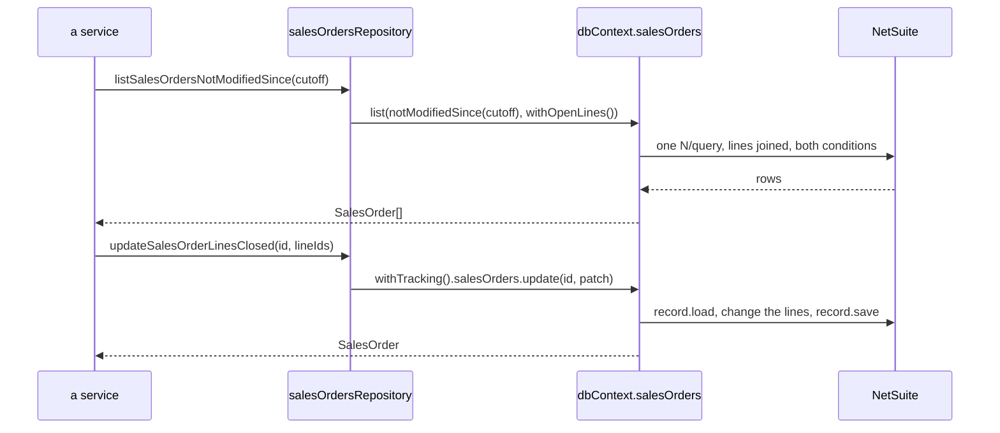

# A record, end to end

One record type, the sales order. A model declares the fields this application uses, `npm run generate` turns it
into types and a record set, the specifications name the filters, and the repository functions read and write
through them. Nothing above the repository sees any of it: a service calls `listSalesOrdersByCustomer(7)` and gets
`SalesOrder[]` back.{{#if netsuiteApi}} The [controller](../controllers/restlet-controller.md) and [job](../jobs/map-reduce-job.md)
examples build on these functions.{{/if}}

## Steps

1. **The model**, one class per record type under `api/src/models/` (the `nspModel` snippet: every decorator once,
   to delete down to what the record needs). A sublist line is a record type too, in a file of its own.
2. **`npm run generate`**, after every change to a model. It writes the entity types into
   `api/src/types/models.gen.ts` and the record set into `api/src/repositories/generated/`.
3. **The specifications**, `api/src/specifications/<records>Specifications.ts` (the `nspSpecification` snippet shows
   every kind of condition): one condition per builder.
4. **The repository**, `api/src/repositories/<records>Repository.ts` (`nspRepository`, every read and write the set
   offers): the only functions that touch the records.
5. **The test**, `api/__tests__/repositories/<records>Repository.test.ts` (`nspTestRepository`), against a fake
   `dbContext`.

## The code

Everything a developer writes is below, in the order it is written. Two things are not in the block, because
nobody writes them:

- **`api/src/repositories/generated/`**, written by `npm run generate`: `SalesOrder.gen.ts` (the config the runtime
  reads, and `SalesOrderFields`, the field paths `where()` and `orderBy()` take), `SalesOrderLine.gen.ts`, and
  `context.gen.ts`, which puts a `salesOrders` set on `dbContext`. Nobody edits them.
- **An SDF object.** A model declares a record NetSuite already has, so it creates nothing in the account. A custom
  record of this application has its own object under `netsuite/Objects/`, beside the model.

```typescript
// ─────────────────────────────────────────────────────────────────────────────────────────────────
// api/src/models/SalesOrderLine.ts                         a sublist line is a record type of its own
// ─────────────────────────────────────────────────────────────────────────────────────────────────

import { Field, InternalId, ParentId, ReadOnly, RecordType } from '@amerilux/netsuite-repository';

/**
 * One item line of a sales order. NetSuite queries lines as `transactionline` rows, so the line class is a record
 * type like any other, and its `@ParentId()` property is the field that joins a line to its order.
 * Run `npm run generate` after editing: it refreshes api/src/repositories/generated/ and api/src/types/models.gen.ts.
 */
@RecordType('transactionline')
export class SalesOrderLine {
    /** Queried as `id`, written through the sublist field `line`: NetSuite names the key differently on each side. */
    @InternalId()
    @Field('line', { queryFieldId: 'id' })
    id!: number;

    @ParentId()
    @Field('transaction')
    @ReadOnly()
    salesOrderId!: number;

    @Field('item')
    itemId!: number;

    @Field('isclosed')
    isClosed!: boolean;
}

// ─────────────────────────────────────────────────────────────────────────────────────────────────
// api/src/models/SalesOrder.ts                             the record: its type, and every field id the
//                                                          application uses, declared here and nowhere else
// ─────────────────────────────────────────────────────────────────────────────────────────────────

import { Field, NetsuiteRecordType, ReadOnly, RecordType, Sublist } from '@amerilux/netsuite-repository';
import type { SalesOrderLine } from './SalesOrderLine';

/**
 * One sales order: the header fields this application reads and writes, and its item lines. Every declared
 * property is a field; a decorator only says what the property's name and type do not.
 * Run `npm run generate` after editing: it refreshes api/src/repositories/generated/ and api/src/types/models.gen.ts.
 */
@RecordType(NetsuiteRecordType.SALES_ORDER)
export class SalesOrder {
    /** The property `id` is the internal id, so it needs no decorator. */
    id!: number;

    @Field('tranid')
    tranId!: string;

    /** No decorator: the field id is the property's name in lower case, `trandate`. */
    tranDate!: Date;

    /** A select field with no reference behind it says so: N/query compares it through ANY_OF, not EQUAL. */
    @Field('entity', { type: 'select' })
    customerId!: number;

    @Field('salesrep', { type: 'select' })
    salesRepId!: number | null;

    memo!: string | null;

    /** The status as NetSuite shows it. A display text is read-only. */
    @Field({ queryFieldId: 'status', text: true })
    statusText!: string;

    @Field('lastmodifieddate')
    @ReadOnly()
    lastModified!: Date;

    /** A salesorder query has no join to its lines, so they are read from the transaction root, without the header line. */
    @Sublist('item', { queryType: 'transaction', relationship: 'transactionlines', filter: [{ fieldId: 'mainline', operator: 'IS', values: [false] }] })
    lines!: SalesOrderLine[];
}

// ─────────────────────────────────────────────────────────────────────────────────────────────────
// api/src/types/models.gen.ts                              what `npm run generate` writes from the two
//                                                          models (an excerpt); never edited
// ─────────────────────────────────────────────────────────────────────────────────────────────────

export interface SalesOrder {
    id: number;
    tranId: string;
    tranDate: Date;
    customerId: number;
    salesRepId: number | null;
    memo: string | null;
    statusText: string;
    lastModified: Date;
    lines: SalesOrderLine[];
}

/** What `update()` takes for a SalesOrder: a deep partial; subrecords merge, sublists take { update, add, remove }. */
export type SalesOrderPatch = EntityPatch<SalesOrder>;
/** What `create()` takes for a SalesOrder: a deep partial with sublists as arrays of partial lines. */
export type SalesOrderCreate = EntityCreate<SalesOrder>;

export interface SalesOrderLine {
    id: number;
    salesOrderId: number;
    itemId: number;
    isClosed: boolean;
}

// ─────────────────────────────────────────────────────────────────────────────────────────────────
// api/src/specifications/salesOrdersSpecifications.ts      the query vocabulary: one condition per builder,
//                                                          and no decisions
// ─────────────────────────────────────────────────────────────────────────────────────────────────

import type { Specification } from '@amerilux/netsuite-repository';
import { type SalesOrder, SalesOrderFields as Fields } from '../repositories/generated/SalesOrder.gen';

/**
 * The query vocabulary for sales orders: one condition per builder. A repository function composes them, and a
 * field path that does not exist on the model is a compile error here, not a failed query in NetSuite.
 */

export const forCustomer = (customerId: number): Specification<SalesOrder> =>
    (query) => query.where(Fields.customerId, '=', customerId);

/** A date compares with a Date: `<` becomes N/query's BEFORE. */
export const notModifiedSince = (cutoff: Date): Specification<SalesOrder> =>
    (query) => query.where(Fields.lastModified, '<', cutoff);

/**
 * A condition on a line field narrows the lines, and a sublist is joined inner, so only the orders with an open
 * line come back, each carrying its open lines only.
 */
export const withOpenLines = (): Specification<SalesOrder> =>
    (query) => query.where(Fields.lines.isClosed, '=', false);

// ─────────────────────────────────────────────────────────────────────────────────────────────────
// api/src/repositories/salesOrdersRepository.ts            sentences built from the vocabulary: every read
//                                                          and write of a sales order goes through here
// ─────────────────────────────────────────────────────────────────────────────────────────────────

import type { SalesOrder } from '../types/models.gen';
import { dbContext } from './generated/context.gen';
import { SalesOrderFields as Fields } from './generated/SalesOrder.gen';
import { forCustomer, notModifiedSince, withOpenLines } from '../specifications/salesOrdersSpecifications';

/**
 * Data access for sales orders. A read goes through `dbContext.salesOrders` and tracks nothing. A write asks
 * `dbContext.withTracking()` for a tracker of its own and finishes before the function returns, so no tracked
 * record outlives the call that changed it.
 */

/** Every sales order of the customer with its lines, newest first. */
export function listSalesOrdersByCustomer(customerId: number): SalesOrder[] {
    return dbContext.salesOrders.list(forCustomer(customerId), (query) => query.orderByDesc(Fields.tranDate));
}

/** The orders nobody has changed since the cutoff that still have an open line, with their open lines. */
export function listSalesOrdersNotModifiedSince(cutoff: Date): SalesOrder[] {
    return dbContext.salesOrders.list(notModifiedSince(cutoff), withOpenLines());
}

/** One sales order with every line, or null when no sales order has the id. */
export function findSalesOrder(salesOrderId: number): SalesOrder | null {
    return dbContext.salesOrders.find(salesOrderId);
}

/** Replaces the memo, or clears it with null. Only a body field changes, so NetSuite is written with one submitFields call. */
export function updateSalesOrderMemo(salesOrderId: number, memo: string | null): SalesOrder {
    return dbContext.withTracking().salesOrders.update(salesOrderId, { memo });
}

/**
 * Closes the given lines. A sublist changes, so the record is loaded, the lines are changed and it is saved; a
 * line patch names its line by `id`. Throws when NetSuite refuses the save.
 */
export function updateSalesOrderLinesClosed(salesOrderId: number, lineIds: number[]): SalesOrder {
    return dbContext.withTracking().salesOrders.update(salesOrderId, { lines: { update: lineIds.map((id) => ({ id, isClosed: true })) } });
}

// ─────────────────────────────────────────────────────────────────────────────────────────────────
// api/__tests__/repositories/salesOrdersRepository.test.ts
//                                                          a repository is tested against a fake dbContext
// ─────────────────────────────────────────────────────────────────────────────────────────────────

import { beforeEach, describe, expect, it, vi } from 'vitest';

// The fake carries only what the repository touches: the set's list(), and withTracking() handing back a set
// whose update() records the patch it was given.
const { fakeSalesOrders, fakeTrackedSalesOrders } = vi.hoisted(() => ({
    fakeSalesOrders: { list: vi.fn() },
    fakeTrackedSalesOrders: { update: vi.fn() },
}));
vi.mock('../../src/repositories/generated/context.gen', () => ({
    dbContext: { salesOrders: fakeSalesOrders, withTracking: () => ({ salesOrders: fakeTrackedSalesOrders }) },
}));

import { listSalesOrdersNotModifiedSince, updateSalesOrderLinesClosed } from '../../src/repositories/salesOrdersRepository';

/** Makes list() apply every specification to a query that records what each one asks for. */
function recordSpecifications(): Array<{ method: string; args: unknown[] }> {
    const calls: Array<{ method: string; args: unknown[] }> = [];
    const query: Record<string, (...args: unknown[]) => unknown> = {};
    for (const method of ['where', 'orderByAsc', 'orderByDesc']) {
        query[method] = (...args: unknown[]) => {
            calls.push({ method, args });
            return query;
        };
    }
    fakeSalesOrders.list.mockImplementation((...specifications: Array<(query: unknown) => unknown>) => {
        specifications.forEach((specification) => specification(query));
        return [];
    });
    return calls;
}

beforeEach(() => {
    fakeSalesOrders.list.mockReset();
    fakeTrackedSalesOrders.update.mockReset();
});

describe('listSalesOrdersNotModifiedSince', () => {
    it('asks for the orders unchanged since the cutoff that still have an open line', () => {
        const calls = recordSpecifications();
        const cutoff = new Date('2026-06-01T00:00:00Z');

        listSalesOrdersNotModifiedSince(cutoff);

        expect(calls).toEqual([
            { method: 'where', args: ['lastModified', '<', cutoff] },
            { method: 'where', args: ['lines.isClosed', '=', false] },
        ]);
    });
});

describe('updateSalesOrderLinesClosed', () => {
    it('patches each line by its id, through a tracker of its own', () => {
        updateSalesOrderLinesClosed(12, [1, 3]);

        expect(fakeTrackedSalesOrders.update).toHaveBeenCalledWith(12, { lines: { update: [{ id: 1, isClosed: true }, { id: 3, isClosed: true }] } });
    });
});
```

## What happens at run time



1. **A read** applies each specification, in order, to one query builder, and runs it as one N/query. The query joins
   only what its fields, conditions and sorts touch, and it pages through the rows itself. Each row is mapped
   into a `SalesOrder`: `T` and `F` become booleans, date strings become `Date`s, numeric strings become numbers.
   Nothing is tracked, so a read costs nothing afterwards.
2. **`find(id)`** is the same query with a condition on the internal id. It answers `null` for an id that is not
   there; `getById(id)` throws instead.
3. **A write** asks `dbContext.withTracking()` for a new context. `update(id, patch)` reads the record, applies the
   patch and plans the cheapest save: body fields alone go through one `record.submitFields`; a sublist or subrecord
   change loads the record, changes it and saves it. It throws `RecordNotFoundError` for an id that is not there,
   and `SaveChangesError` when NetSuite refuses the save.
4. The tracker ends with the function. The only context at module scope is the one behind `dbContext`'s sets,
   which never tracks, so nothing depends on how long NetSuite keeps a module alive.

## The variations

- **A change across several records** keeps one tracker in a local, reads through it, changes the records it
  answered, and saves once. `saveChanges()` does not throw: it answers an outcome per record, so a flow that must
  fail loudly reads it.

  ```typescript
  export function updateSalesOrderMemosForCustomer(customerId: number, memo: string): void {
      const tracked = dbContext.withTracking();
      for (const salesOrder of tracked.salesOrders.list(forCustomer(customerId))) salesOrder.memo = memo;
      const result = tracked.saveChanges();
      if (!result.success) throw new Error('Some memos were not saved.');
  }
  ```

- **A reference** is a property typed as another model, and its declared type is the projection read:
  `customer?: Pick<Customer, 'id' | 'companyName'>` reads two fields of the customer through `customerId`, the
  select field behind it. A reference is read-only; to change it, write the select field.
- **A custom record** is named by its id, `@RecordType('customrecord_{{prefix}}_order_note')`, and has its own SDF
  object under `netsuite/Objects/`.
- **A create** goes through the same tracker: `dbContext.withTracking().salesOrders.create(fields)` takes a
  `SalesOrderCreate` (lines as an array) and answers the order with its new id (the `nspRepository` snippet writes one).
- **A NetSuite module** rather than a record is read in a repository too: {{#if userRolesExample}}`activeUserRepository.ts` reads
  {{/if}}`N/runtime` for the session (the `nspRepositoryModule` snippet). No layer above the repository imports `N/*`.
{{#if netsuiteApi}}
- **Another script of this application** is data for a repository as well:
  [controllers/suitelet-controller.md](../controllers/suitelet-controller.md) calls a Suitelet from one.
{{/if}}
